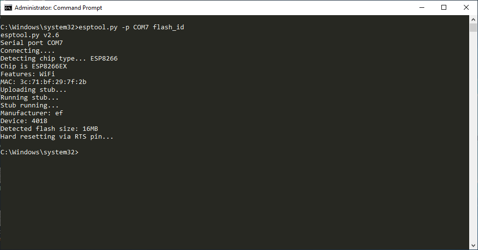

I successfully upgraded RAM and ROM FLASH of my tp-link mr3220 v2 router.

I used esptool and nodemcu v2 for this. 

## Parts List

I bought from these links, took 20 days to get them delivered to Delhi, India.

flash rom: <https://www.aliexpress.com/item/5PCS-W25Q128FVSG-SOP8-25Q128FVSG-SOP-25Q128-SMD-new-and-original-IC-free-shipping/32540622038.html?spm=a2g0s.9042311.0.0.27424c4ddOXbCt>

ram: <https://www.aliexpress.com/item/HY5DU121622DTP-D43-64M-HY5DU121622/32377517290.html?spm=a2g0s.9042311.0.0.27424c4dbR7eKE>

## Software prerequisites

**esptool**

Windows: cmd as administrator then `pip install esptool`

Linux:  `sudo pip3 install esptool`

**Note:**

​	In my case esptool on linux was not able to write the flash rom, hence i used it on windows and it worked 	like charm. 

​	If using on Windows **Don't forget to cmd as administrator**

## 1. Upgrading RAM

original ram zentel 32MB

desoldering ram

soldering hynix 64MB ram

checking results

## 2. Upgrading flash rom

I desoldered the flash rom from the nodemcu and solder a blank W25Q128FVSG. 

Then I used esptool to write the flash rom.

### 	2.1 Desoldering ROM Flash

 

### 	2.2 Creating backup of mtd partitions of openwrt

### 	2.3 Writing mtd partitions to new flash rom

step1: Checking flash_id

step2: erasing flash

step 3: writing u-boot

step 4: writing firmware staring after 128kB (u-boot is 128kB in size) hence used offset 0x20000

step 5: art partition is located at last 64kB of flash rom, hence used offset 0xFF0000

step 6: then you desolder  the chip from nodemcu and solder it back to your router.

original flash rom

upgraded flash rom

Checking results:

**Contact**:

telegram username: @dishendra

